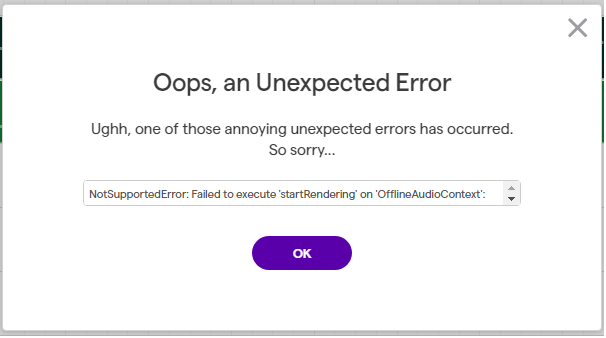

<div align="center">


<h1 align="center">Hii! I'm <b>&lt;/ignistrum&gt;!</b> </h1>


</div>

<div style="display: flex; align-items: flex-start; justify-content: space-between; flex-wrap: wrap; gap: 2rem;">

<div style="flex: 1; min-width: 280px;">


<p align="center">
   <a href="https://git.io/typing-svg"></a>
</p>


<div align="center">
<table>
  <tr>
    <td>You are visitor</td>
    [](http://hits.dwyl.com/ignistrum/ignistrum)
  </tr>
</table>
</div>


</div>

<br><br>     

<!--- ------------------------------------------------------------------------------------------------------------------------------------------------------ -->
<!--- -- Nice to Meet You ---------------------------------------------------------------------------------------------------------------------------------- -->
<!--- ------------------------------------------------------------------------------------------------------------------------------------------------------ -->


```
████████████████████████████████████████████████████████████  ██╗  ██╗███████╗██╗     ██╗      ██████╗  ██╗ 
████████████████████████████████████████████████████████████  ██║  ██║██╔════╝██║     ██║     ██╔═══██╗ ██╗ 
███████████████████████████████████`.        ╙██████████████  ███████║█████╗  ██║     ██║     ██║   ██║ ██╗ 
████████████████████████████████▀  ¿▓▓▓▓▓▓▓▓▄/ "████████████  ██╔══██║██╔══╝  ██║     ██║     ██║   ██║ ██╗ 
██████████████████████████████▀.  ▓▓▓▓▓▓▓▓▓▓▓▓   ▐██████████  ██║  ██║███████╗███████╗███████╗╚██████╔╝  
██████████████████████████████ `  ▓▓▓▓▓▓▓▓▓▓▓▓  ` ██████████  ╚═╝  ╚═╝╚══════╝╚══════╝╚══════╝ ╚═════╝   █╗
██████████████████████████████ `  ▓▓▓▓▓▓▓▓▓▓▓▓   ▄██████████
▀██████████████████████████████▌  ▀▀▓▓▓▓▓▓▓▌╓╖. ████████████  ███╗   ██╗██╗ ██████╗███████╗  ████████╗ ██████╗
█▄▀██████████████████████████████▄ ╩╦╙▀▀▀▀▀ ╣`,█████████████  ████╗  ██║██║██╔════╝██╔════╝  ╚══██╔══╝██╔═══██╗
▄▀█▄╙█████████████████████▀▀▀▀█████▄▄ .... ,▄███████▀███████  ██╔██╗ ██║██║██║     █████╗       ██║   ██║   ██║
██▄▀█▄╙█████████████████▀  ╪╢%╦══~╓,└ ╚▒▒▒ ╙▀|,╓╓═╤H   ▀████  ██║╚██╗██║██║██║     ██╔══╝       ██║   ██║   ██║
█▀▀▀-▀█▌▄▀█████████████   ║▒▒▒▒▒▒▒▒▒▒╢╦ ╘ -╣▒▒▒▒▒▒▒▒▒╢╕   ▀█  ██║ ╚████║██║╚██████╗███████╗     ██║   ╚██████╔╝
██▄▀██└║▄▄▄████████████▄          ═╕╕╕╕╕═╕═══════       ▄▄▄▄  ╚═╝  ╚═══╝╚═╝ ╚═════╝╚══════╝     ╚═╝    ╚═════╝
████▄▀█▌║███  ████████▌         ╕   ╩▒▒▒▒▒▒▒▒▒Ñ          ███
██████▌Ö▓▌   ▀██████████`╔▒▒╣ █ ▒▒m   ╚▒╢▒▒▒╩ -╣▒ ▌ ▒▒▒ ████  ███╗   ███╗███████╗███████╗████████╗  ██╗   ██╗ ██████╗ ██╗   ██╗    ██╗██████╗
████ -"" ∞╙,▀.╙▀███████╜ ▒▒▒ ▄█ Ñ   -   S.  ═▒▒▒▒ █ ║▒▒╕└███  ████╗ ████║██╔════╝██╔════╝╚══██╔══╝  ╚██╗ ██╔╝██╔═══██╗██║   ██║    ╚═╝██╔══██╗ 
████████▄ -«   ∞▄.▀",╓═     ╒██   ═╣▒▒ `Ñ╛        █▌ ▒▒▒ ███  ██╔████╔██║█████╗  █████╗     ██║      ╚████╔╝ ██║   ██║██║   ██║       ██║  ██║
█████████▌ º     ╤╣▒╣╩^",▄▄███▀  ▒▒╣"     ''''''' ▀▀     `██  ██║╚██╔╝██║██╔══╝  ██╔══╝     ██║       ╚██╔╝  ██║   ██║██║   ██║       ██║  ██║
█████████  ▌       ▄▄████████─         ---------    L'▒▒▒ ██  ██║ ╚═╝ ██║███████╗███████╗   ██║        ██║   ╚██████╔╝╚██████╔╝    ██╗██████╔╝
▀▀▀▀▀▀▀▀▀▀▀▀▀-     ▀▀▀▀▀▀▀▀▀▀       '╧╧╧╧╧╧╧╧╧`     ╚ ╧╧╧- ▀  ╚═╝     ╚═╝╚══════╝╚══════╝   ╚═╝        ╚═╝    ╚═════╝  ╚═════╝     ╚═╝╚═════╝ 
```

<br><br>     

</div>

<a href="https://github.com/Anmol-Baranwal/GIFs-For-Readme"></a><a href="https://github.com/Anmol-Baranwal/GIFs-For-Readme"></a>

## `#` Discord Status


---

## `#` Achievements
<div>
  
</div>


## `#` Skillset

<div>
  
  <br>
  
  <br>
  
  <br>
  
  <br>
  
  <br>
  
  <br>
</div>

---

## `#` Personality

### IT'S OFF CENTER!!! Now I'm gonna have to move it again...

<p align="center">
  
</p>


---
  
## `#` Find Me

<table>
  <tr>
    <td> Reddit</td>
    <td><a href="https://reddit.com/u/ignistrum">u/ignistrum</a></td>
  </tr>
  <tr>
    <td> Discord</td>
    <td><code>ignistrum</code></td>
  </tr>
   <tr>
      <td> Chess.com</td>
      <td><a href="https://chess.com/member/IgnistrumChess">IgnistrumChess</a></td>
   </tr>
</table>


## <b> `#` Github Stats </b>
<br>

<div align="center">

<a href="https://github.com/ignistrum/">
  
  


<h2><code>#</code> The reason behind my success:</h2>

### Ramanujacharya

# 


